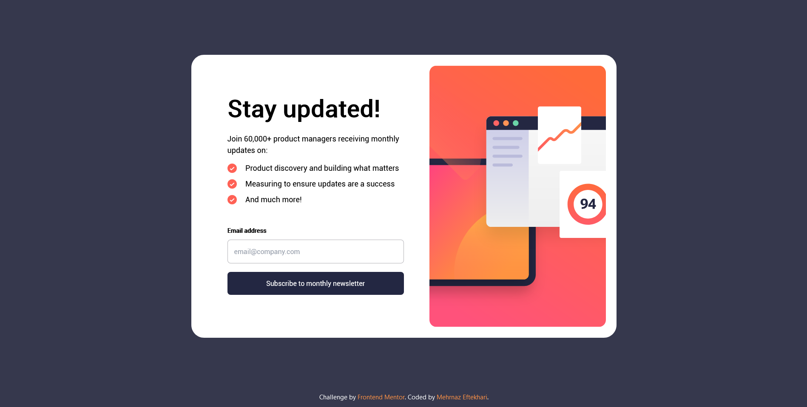
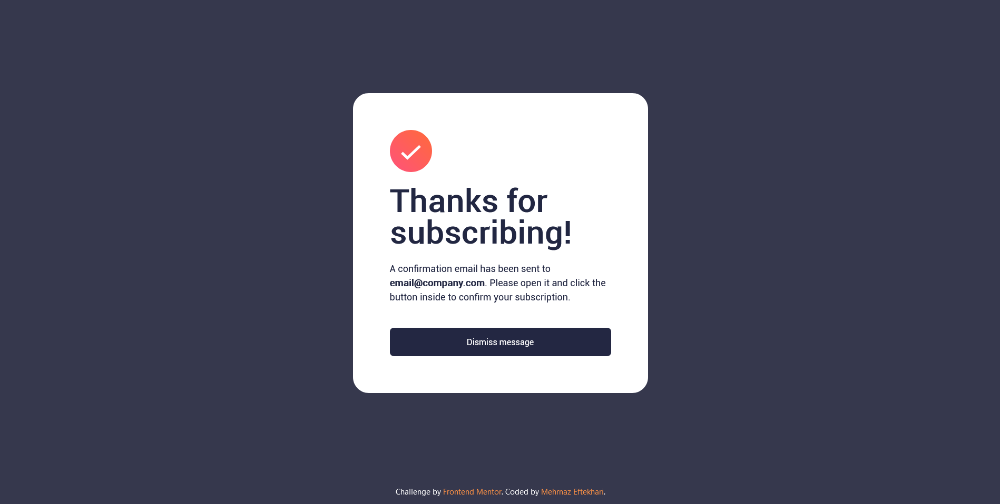
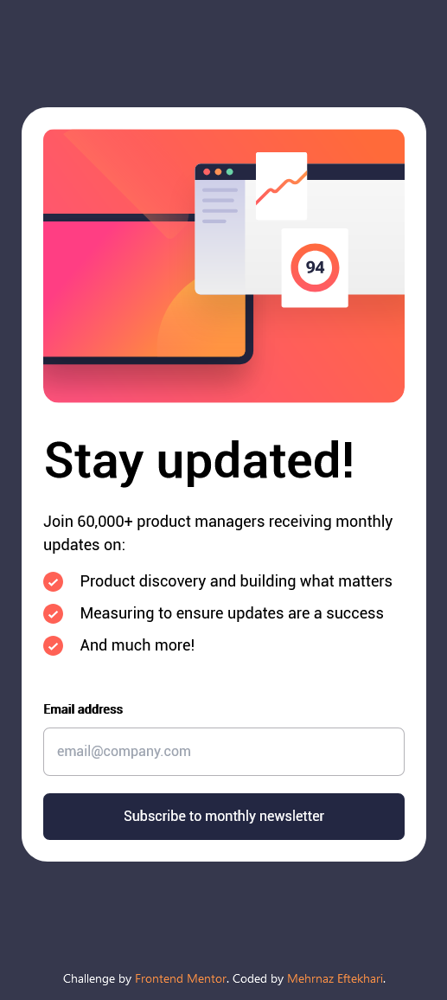

# Frontend Mentor - Newsletter Sign-Up Form with Success Message Solution

This is a solution to the [Newsletter Sign-Up Form with Success Message challenge on Frontend Mentor](https://www.frontendmentor.io/challenges/newsletter-signup-form-with-success-message-3FC1AZbNrv). Frontend Mentor challenges help you enhance your coding skills by building realistic and accessible projects.

## Table of Contents

- [Overview](#overview)
  - [The Challenge](#the-challenge)
  - [Screenshots](#screenshots)
  - [Links](#links)
- [My Process](#my-process)
  - [Built With](#built-with)
  - [What I Learned](#what-i-learned)
  - [Continued Development](#continued-development)
  - [Color Palette](#color-palette)
  - [Fonts](#fonts)
- [Author](#author)
- [Acknowledgments](#acknowledgments)

## Overview

### The Challenge

Users should be able to:

- Add their email and submit the form
- See a success message with their email after successfully submitting the form
- See form validation messages if:
  - The field is left empty
  - The email address is not formatted correctly
- View the optimal layout for the interface depending on their device's screen size
- See hover and focus states for all interactive elements on the page

### Screenshots

### Links

- Solution URL: [View on GitHub](https://github.com/mehrnaz98/newsletter-signup-form)
- Live Site URL: [View on Netlify](https://stellar-lamington-6f0d1c.netlify.app/)

## My Process

### Built With

- Semantic HTML5 markup
- Tailwind CSS for styling
- Vue 3 (Composition API) for interactivity
- JavaScript for email validation and state management

### What I Learned

This project deepened my understanding of Vue 3's Composition API. I also gained more experience implementing form validation and handling dynamic states like toggling between the form and success message views.

### Continued Development

I aim to enhance my skills in creating reusable Vue components and improving accessibility in form elements. Future projects will focus on more interactive components and state management with Pinia.

### Color Palette

#### Primary

- Dark Grayish Blue: hsl(217, 19%, 35%)
- Desaturated Dark Blue: hsl(214, 17%, 51%)

#### Neutral

- Grayish Blue: hsl(212, 23%, 69%)
- Light Grayish Blue: hsl(210, 46%, 95%)

### Fonts

- Family: [Manrope](https://fonts.google.com/specimen/Manrope)
- Weights: 500, 700

## Author

- GitHub - [Mehrnaz98](https://github.com/mehrnaz98)
- Frontend Mentor - [Mehrnaz98](https://www.frontendmentor.io/profile/mehrnaz98)

## Acknowledgments

A special thanks to the Frontend Mentor community for the challenge and inspiration.
